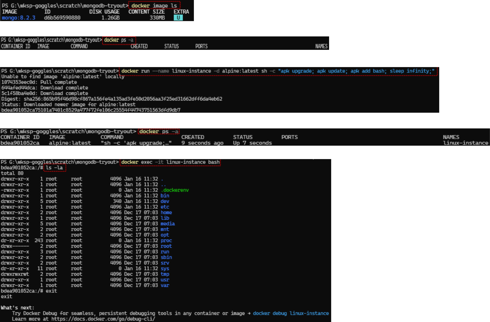

## Start a container

### 1. Directly with docker commands
  **i.** Start up a linux container directly using a docker command  
  To get an understanding of how things work on docker, start up a linux instance from the command line and then attach to it.  
  
  `docker run --name linux-instance -d alpine:latest sh -c "apk upgrade; apk update; apk add bash; sleep infinity;"`  
  
  *Illustrative trace*  
    
  
  
### 2. With docker compose  
  **i.** Start up a linux container using a docker compose file  
  `docker compose -f .\single-container.yml up -d`  
  
  To stop the instance started with docker-compose run `docker compose -f .\single-container.yml down`
  
