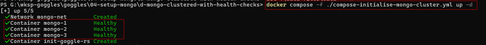
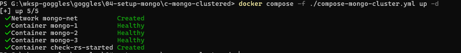

## Approach
This is done by first running a one time docker compose project to :-
1. Change the ownership and permissions of the encryption keys used for securing the MongoDb services
2. Create the MongoDb Replica-Set (i.e. the cluster) and add members to it
3. Create users and enable access controls.

Subsequently we start and stop the cluster with another docker compose project.

## Initialising.
To initialise the run `docker compose -f ./compose-initialise-mongo-cluster.yml up -d`
### Points to note.
  1. The compose project contains four services. The first three services, ***mongo-1*** , ***mongo-2*** and ***mongo-3*** are three nodes that are going to be part of the Replica-Set. 
  2. The fourth service ***init-goggle-rs*** configures the Replica-Set and creates an admin user and roles. 
  3. A file with the ssh-keys on the docker host is mapped to a file in the ***mongo-1*** container. When this container starts it changes the ownership and permissions of this mapped file.

## Check the initilisation completes successfully
1. After running `docker compose -f ./compose-initialise-mongo-cluster.yml up -d` wait for all the containers to signal they are healthy  

   
   
  
2. Next check the initialisation logs by running `docker logs init-goggle-rs`

3. Once initialisation has completed successfully run `docker compose -f ./compose-initialise-mongo-cluster.yml down` to bring down the initialised nodes started in the previous step.  
  
  
## Running the MongoDb cluster

  1. Restart the cluster with `docker compose -f ./compose-mongo-cluster.yml up -d` and wait for all three containers to become healthy.
    
  
  2. Check the status of the cluster by inspecting the logs with `docker logs check-rs-started`
    
  
  3. Check by trying to access mongo with the configured username and password `docker exec -it mongo-1 mongosh --authenticationDatabase "admin" -u "the_username" -p "the_password" --eval "rs.status()"`.  
  
  4. Once the cluster is up run a mongo command to do a further test. Try something like `docker exec -it mongo-1 mongosh --authenticationDatabase "admin" -u "the_username" -p "the_password" --eval "show databases"`  
  
  5. Once everything is running the initialisation steps are no longer needed for subsequent restarts.
  
## Generating the ssh keys
Using openssl run `openssl rand -base64 -out example.key 756`  

### [Back](../readme.md)