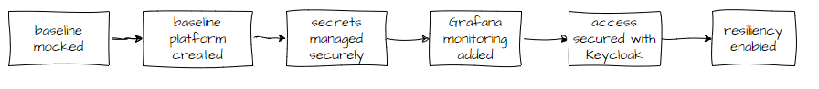
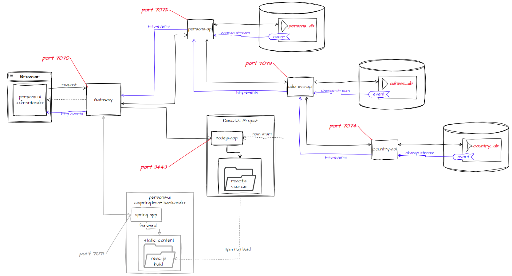

# Building a secure event driven micro-services based platform

Below is an outline of the approach to building the platform.  

## 1. Build baseline platform
The baseline platform will be fully functioning but lacking the non-functional capabilities such as security, monitoring and resiliency. It will then be enhanced stage by stage to add on and enable these capabilities and drive the architecture and approach to explore and illustrate ideas, concepts and become a reference which can be used to develop real world applications.

The baseline platform will be based around an address book that holds contact details of people.

## 2. Architecture and Design

  

## [Home](../README.md)