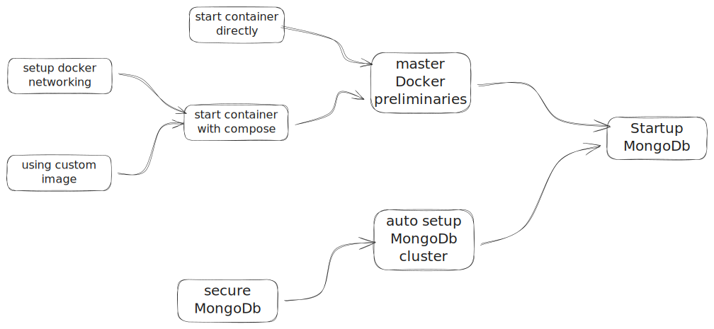

# Goggles

## A Reference repository to set up, develop, deploy, run, monitor and manage a web project

## 1. The Plan
  

### 2. The stack
**i.** GitHub - code and configuration management  
**ii.** Eclipse - integrated development environment  
**iii.** Docker - container based hosting environment  
**iv.** Java - Development Language  
**v.** SpringBoot - Java framework  
**v.** MongoDb - database

### 3. The Repository
Everything starts with the repository so needs to be set up and interfaced with the Eclipse integrated development environment.  
[Notes on setting up the repository](02-setup-repository/readme.md)

### 4. Project (Repository) Layout
**README.md** file - This file. Root or Home readme file. Describes key aspects of the project and links to other notes.   
**00-notes** folder - Contains sub-folders with detailed additional readme files organised by category and linked to from the Home readme  

### 5. Run fabric components in containers
Underpinning components such as databases, monitoring-server, web-servers, application-servers etc. will run within Docker containers and so [understanding how to setup, orchestrate,  startup, monitor and manage them](./03-working-with-docker/readme.md) will be important.

### 6. Setting up a database
[MongoDb setup](04-setup-mongo/a-mongodb-with-docker-cmd/readme.md) to support an event driven services architecture and under pin the systems and services developed.

### General stuff
**i.** [Markdown Cheat Sheet](https://github.com/adam-p/markdown-here/wiki/Markdown-Cheatsheet)  